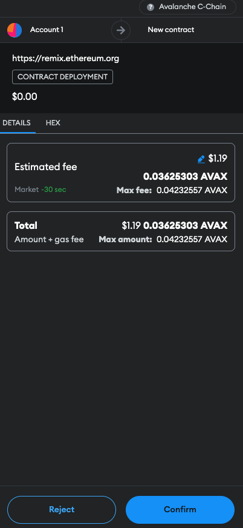

# Create ERC20 on Avalanche

1. First of all, we are going to help ourselves with a wallet called metamask where we are going to configure and work on the Avalanche test network (Funji).

2. After downloading it and interacting with it we are going to add the Avalanche test network, we go to the upper left where it shows us the network and select the `Add network` button, in the final part we will select `Add a network manually`


3. Now fill in the following details and click on “Save”.

```
- Network name: Avalanche C-ChainNew 
- RPC URL: https://api.avax-test.network/ext/bc/C/rpcChain 
- ID: 43113
- Currency symbol: AVAX
- Block explorer URL: https://testnet.snowtrace.io
```

4. Select `Save` and click on `Switch to Avalanche C-Chain` button and switch to your newly added network. now let's add some tokens to our newly created Avalanche account with AVAX using faucet (test) en el siguiente [link faucet](https://core.app/tools/testnet-faucet). Copy the account address, paste it where specified and claim an amount of AVAX.


5. After already having some AVAX in the account, we are going to go to a [Remix](https://remix.ethereum.org/) Integrated Development Environment (IDE) to be able to create our implementation contract for a new ERC20 token.


6. Now let’s build a simple ERC20 token in Solidity programming language with a mint functionality, so that you can mint it easily as well.

- In the contracts folder we are going to create a file called "myToken.sol"

- Let's work with OpenZeppelin is an open-source framework that helps build secure smart contracts. It provides variety of smart contracts, tokens and multiple other functionalities to make our life easier.For our use case, we will inherit the functionalities of ERC20 token contract and use the constructor and mint function to create and mint our custom made ERC20 token.

```
// SPDX-License-Identifier: MIT
pragma solidity ^0.8.25;

import "@openzeppelin/contracts@4.7.3/token/ERC20/ERC20.sol";

contract MyCrypto is ERC20 {

    address public owner;

    constructor() ERC20("MetaCoin", "META") {
        _mint(msg.sender,  65000000000000000000000000000);
    }
}
```

- MetaCoin: name your token

- META: symbol your token

- (100 * 10 ** ERC20.decimals()): supply amount


7. Deploy ERC20 Token on Avalanche

- compile the file


- Now, I will show you how to deploy your token, but before that you need to connect Remix IDE to your Metamask account.

- Click on deploy icon (left sidebar) that is right next to the compile icon in the side bar.

- Click and scroll through the “Environment” bar and select “Injected Provider - Metamask.

- ”The Metamask page will appear. Click on “Next” and “Connect” to finally connect your Metamask to Remix IDE.


8. Now, we will officially deploy our token.

- Click on “Deploy” button to deploy your contract.
- Click on “Confirm” to confirm the transaction of AVAX from your Metamask.



9. Now that we have implemented the contract, we are going to add our token to metamask and be able to interact with it.

- copy address contract


- We go to metamask and in the "token" section we select "import token"


- Paste contract address and we place the token symbol and select `next` and `import`.


- ready you have created the token and now you can interact with it


